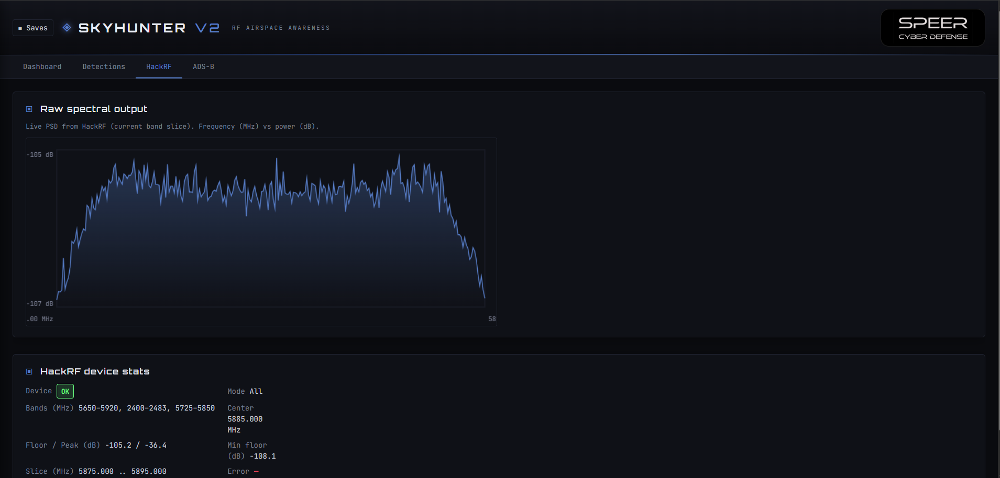
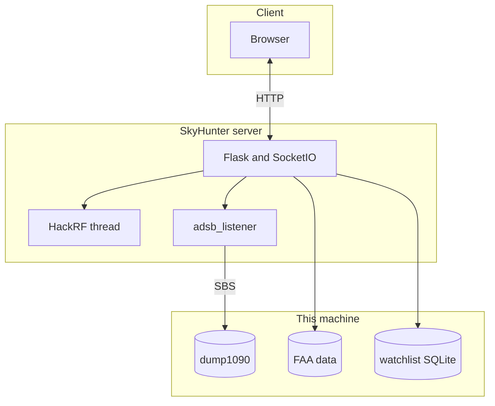
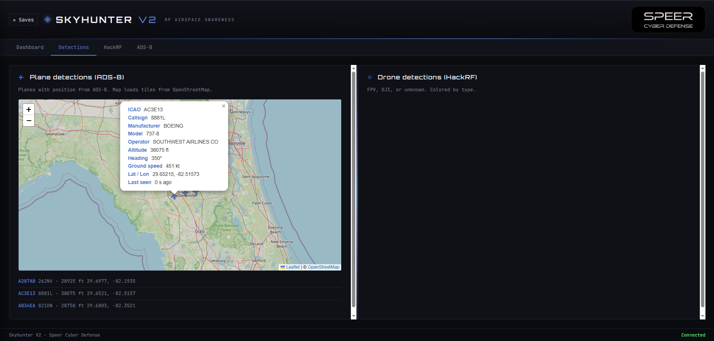

# SkyHunter V2

<p align="center">
  
</p>


**RF airspace awareness in one dashboard** — live drone RF sensing with a **HackRF One**, plus **ADS-B** aircraft on a map, optional **FAA-backed identity** for planes, and optional **watchlist-style alerts** when an aircraft matches a BaseStation SQLite database. Built for Linux and **WSL 2** on Windows, with a modern web UI you can open from your laptop or phone on the LAN.

> **Why it’s interesting:** Most tools pick *either* SDR hobby RF *or* flight tracking. SkyHunter V2 combines them so you can correlate what you hear in the spectrum with what’s overhead — useful for researchers, RF enthusiasts, airspace awareness, and anyone learning how 2.4/5.8 GHz drone links and 1090 MHz ADS-B fit together. No cloud account required; data stays on your machine.

---

| | |
|---:|---|
| **HackRF** | Sweeps 2.4 / 5.8 GHz (and related bands), PSD + heuristics for **DJI-style** and **analog FPV**-like signals |
| **ADS-B** | **dump1090** SBS on **port 30003** — bundled via `setup.sh` or use your own decoder |
| **Web UI** | Dashboard, Detections (map + drones), HackRF spectrum, ADS-B pipe, **Alerts** (DJI / FPV / ADS-B columns) |
| **FAA data** | **Auto-downloaded** into `data/` during setup (official ZIP), or fetch manually |
| **Watchlist DB** | Optional **`basestation.sqb`** (BaseStation-style) for **ADS-B “spy plane”** alerts on flagged aircraft |
| **Offline map** | Cached OSM tiles under `static/map-tiles/`; pre-seed with `scripts/download_map_tiles.py` |

---

## Table of contents

- [Screenshots](#screenshots)
- [Architecture](#architecture)
- [Quick start](#quick-start)
- [Prerequisites](#prerequisites)
- [Installation](#installation)
- [FAA registry data](#faa-registry-data)
- [Map tiles & offline use](#map-tiles--offline-use)
- [ADS-B & dump1090](#ads-b--dump1090)
- [HackRF workflow](#hackrf-workflow)
- [Watchlist & ADS-B alerts](#watchlist--ads-b-alerts)
- [Using the web UI](#using-the-web-ui)
- [Project layout](#project-layout)
- [Configuration & API](#configuration--api)
- [How it works (technical)](#how-it-works-technical)
- [Troubleshooting](#troubleshooting)
- [Development notes](#development-notes)
- [License & credits](#license--credits)

---


## Architecture



**In plain terms:** the browser talks to **Flask**. One background thread runs the **HackRF** sweep and classification. A small listener reads **SBS lines** from **dump1090** (or anything else speaking the same stream on **30003**). Plane popups can use **FAA** files in `data/`; the **Alerts** tab can show ADS-B cards when **`basestation.sqb`** matches a watchlisted aircraft (BaseStation **Interested** semantics).

---

## Quick start

1. **Install OS packages** (Ubuntu / Debian / WSL) — see [Prerequisites](#prerequisites).
2. **Clone** the repo and enter the project directory.
3. **Run setup** (creates `.venv`, installs Python deps, **fetches FAA data** unless skipped, clones/builds **dump1090** if tools are present):

   ```bash
   chmod +x setup.sh run.sh
   ./setup.sh
   ```

4. **Start the server:**

   ```bash
   ./run.sh
   ```

5. **Open the URL** printed in the terminal (by default **`http://localhost:5050`** on the same machine; under WSL, use the **Windows** URL if shown).

That’s it. Optional: drop **`basestation.sqb`** in the project root for watchlist ADS-B alerts.

---

## Prerequisites

### Hardware

| Role | Hardware |
|------|----------|
| Drone RF detection | **HackRF One** (or compatible) + USB |
| ADS-B map & aircraft list | **RTL-SDR** on **1090 MHz** (optional — UI and HackRF features work without it) |
| Antennas | 2.4 / 5.8 GHz for HackRF; 1090 MHz for ADS-B |

### Software

| Platform | Notes |
|----------|--------|
| **Linux** | Ubuntu **22.04+** (or similar) recommended. Other distros should work; less tested. |
| **Windows** | Use **WSL 2** + Ubuntu. Pass USB devices from Windows with **[usbipd-win](https://github.com/dorssel/usbipd-win)**. |
| **Python** | **3.10+** (`python3`, `python3-venv`). Dependencies live in **`requirements.txt`**. |

> **Note:** The main ADS-B path does **not** rely on `pyrtlsdr` in application code — decoded traffic is consumed from **dump1090’s SBS stream**.

---

## Installation

### 1. System packages (Linux / WSL)

```bash
sudo apt update
sudo apt install -y hackrf libhackrf0 libhackrf-dev python3 python3-venv python3-pip
sudo apt install -y usbutils   # optional: lsusb
```

**HackRF without sudo** — udev rule (then log out / back in):

```bash
sudo bash -c 'groupadd -f plugdev && usermod -aG plugdev $SUDO_USER && printf "%s\n" '\''SUBSYSTEM=="usb", ATTR{idVendor}=="1d50", ATTR{idProduct}=="6089", MODE="0666", GROUP="plugdev"'\'' > /etc/udev/rules.d/52-hackrf.rules && udevadm control --reload-rules && udevadm trigger'
```

### 2. Windows host → WSL USB

1. Install WSL: `wsl --install -d Ubuntu`
2. Install **[usbipd-win](https://github.com/dorssel/usbipd-win)**
3. In **PowerShell (Admin):** `usbipd wsl list` → `usbipd wsl attach --busid <BUSID>` for HackRF (and RTL-SDR if used)
4. Inside WSL, install the same **`apt`** packages as above

### 3. ADS-B build tools (for bundled dump1090)

If you want **`setup.sh`** to compile **dump1090**:

```bash
sudo apt install -y build-essential librtlsdr-dev pkg-config
```

Run **`./setup.sh`** after this (or re-run it) so **`dump1090/`** is cloned and **`make`** runs.

### 4. Project setup

From the **repository root** (all paths are relative to this directory):

```bash
git clone <your-repo-url>
cd <project-directory>
chmod +x setup.sh run.sh
./setup.sh
```

**What `./setup.sh` does:**

| Step | Action |
|------|--------|
| Virtualenv | `python3 -m venv --clear .venv` — fresh env per machine (fixes broken `pip` shebangs if `.venv` was moved) |
| Python deps | `pip install -r requirements.txt` (via `.venv/bin/python -m pip`) |
| FAA data | Runs **`scripts/fetch_faa_registry.py`** unless disabled — see [FAA registry data](#faa-registry-data) |
| dump1090 | Clones [antirez/dump1090](https://github.com/antirez/dump1090) into **`dump1090/`** and runs **`make`** if possible |

---

## FAA registry data

SkyHunter uses the FAA **releasable aircraft database** so plane popups can show registration, operator, and type when live ADS-B identity is thin. The app primarily reads **`MASTER.txt`** and **`ACFTREF.txt`** from **`data/`**; the official ZIP also ships other `.txt` files (e.g. **DEREG**), which are extracted for completeness.

| Resource | Link |
|----------|------|
| FAA page | [Releasable aircraft download](https://www.faa.gov/licenses_certificates/aircraft_certification/aircraft_registry/releasable_aircraft_download) |
| Direct ZIP | [ReleasableAircraft.zip](https://registry.faa.gov/database/ReleasableAircraft.zip) (~60 MiB compressed) |

### Automatic fetch (default)

- **`./setup.sh`** calls **`scripts/fetch_faa_registry.py`** after installing Python packages.
- The script uses **only the Python standard library** (no extra pip packages).
- If **`MASTER.txt`** and **`ACFTREF.txt`** already exist and are non-empty, the fetch **skips** the download (fast repeat setups).
- If download fails (offline, firewall), **setup still finishes**; run the fetcher later when you have network.

### Environment variables

| Variable | Effect |
|----------|--------|
| **`SKIP_FAA_DOWNLOAD=1`** | Skip the FAA step entirely during `./setup.sh`. Use for air-gapped installs; populate `data/` yourself or run the script later. |
| **`FAA_FETCH_FORCE=1`** | Force re-download during setup (passes **`--force`** to the fetcher). |

### Manual commands

```bash
# Refresh FAA files anytime (re-download + extract)
.venv/bin/python scripts/fetch_faa_registry.py --force
```

Manual alternative: download **ReleasableAircraft.zip**, unzip so all **`.txt`** files land directly in **`data/`**.

> **Git / GitHub:** Very large files (e.g. **MASTER.txt**, **DEREG.txt**) often **aren’t committed** to public repos because they exceed [GitHub’s 100 MiB file limit](https://docs.github.com/en/repositories/working-with-files/managing-large-files/about-large-files-on-github). Cloners should run **`./setup.sh`** or **`python scripts/fetch_faa_registry.py`** to fill **`data/`**.

More detail: **`data/README.md`**.

---

## Map tiles & offline use

The map uses **OpenStreetMap**-style tiles. While online, the server can **cache** tiles under **`static/map-tiles/`** for later **offline** use; uncached areas show a neutral grey (the app stays usable).

**Bulk pre-cache** a region (respect OSM’s [tile usage policy](https://operations.osmfoundation.org/policies/tiles/) — don’t hammer the server):

```bash
# From repo root. Default: zoom 0–10, continental US bbox.
pip install requests    # if not already available in your environment
python scripts/download_map_tiles.py

# Higher zoom + your own bounding box (example pattern)
python scripts/download_map_tiles.py --max-z 12 --bounds 39.0,-96.0,40.0,-95.0
```

> **Canonical script path:** use **`scripts/download_map_tiles.py`** only. A legacy root-level helper was removed to avoid duplication.

See **`static/map-tiles/README.md`** for behavior details.

---

## ADS-B & dump1090

| Topic | Detail |
|-------|--------|
| **Protocol** | SBS/BaseStation-style stream on **TCP `localhost:30003`** |
| **Bundled** | **`setup.sh`** builds **`dump1090/dump1090`** from [antirez/dump1090](https://github.com/antirez/dump1090) |
| **Auto-start** | If **nothing** is listening on **30003** and the binary exists, the server may start dump1090; if **30003** is already open, SkyHunter **attaches** to the existing service |
| **External** | Run any compatible decoder that exposes SBS on **30003** — no need to use the bundled binary |

RTL-SDR must be available to the OS where dump1090 runs. First bring-up after start can take **tens of seconds** before the port opens.

<p align="center">
  
</p>

---

## HackRF workflow

1. Attach **HackRF** (WSL users: **usbipd** attach first).
2. Start **`./run.sh`** — the **HackRF thread** starts with the web server.
3. Tune **gains** (`--lna`, `--vga`, `--amp`) and **sweep** options (`--dwell`, `--auto`, etc.) via CLI flags through **`run.sh`**.
4. Watch **Dashboard** and **HackRF** tabs for spectrum and status; **Detections** lists classified events (FPV / DJI / unknown).

Headless / terminal-only path: **`skyhunter.py`** (curses TUI) — same RF core, no browser.

---

## Watchlist & ADS-B alerts

Optional **`basestation.sqb`** in the **project root** (SQLite, BaseStation-style):

- Opened **read-only** by **`spy_plane_db.py`** with **schema discovery** at runtime.
- Rows with **`Interested != 0`** (where that column exists) are treated as **watchlist** matches.
- When ADS-B traffic matches, the **Alerts** tab can show an **ADS-B** column card (server logs **`[SPY_DB]`** / **`[SPY_ALERT]`**).

**Utility:** **`python inspect_basestation.py`** — prints tables, columns, and watchlist row counts.

If the file is missing, the app runs normally; only this alert path is disabled.

---

## Using the web UI

| Tab | What you get |
|-----|----------------|
| **Dashboard** | HackRF + ADS-B device status at a glance |
| **Detections** | Map + aircraft trails; drone RF list (HackRF) |
| **HackRF** | PSD canvas + detailed detection list |
| **ADS-B** | SDR status, raw feed, paste/ingest lines (**POST `/api/adsb`** on the **same host and port** as the UI) |
| **Alerts** | DJI / FPV (HackRF) + ADS-B watchlist column |
| **Saves** | Save / load / merge sessions |

**Stop:** **Ctrl+C** in the terminal — clean shutdown (including dump1090 if the server started it).

---

## Project layout

| Path | Purpose |
|------|---------|
| **`web_ui.py`** | Flask app, Socket.IO, HackRF thread, dump1090 lifecycle, FAA + optional SQLite lookup, REST APIs |
| **`skyhunter.py`** | HackRF detector + optional curses UI |
| **`libhackrf.py`** | ctypes wrapper for **libhackrf** |
| **`adsb_listener.py`** | SBS client for **localhost:30003** |
| **`spy_plane_db.py`** | **`basestation.sqb`** lookup + schema discovery |
| **`inspect_basestation.py`** | SQLite schema / watchlist inspection CLI |
| **`setup.sh`** | `.venv`, **`requirements.txt`**, FAA fetch, **dump1090** clone/build |
| **`scripts/fetch_faa_registry.py`** | Download & extract **ReleasableAircraft.zip** → **`data/`** |
| **`scripts/download_map_tiles.py`** | Offline OSM tile pre-cache |
| **`run.sh`** | Start **`web_ui.py`** on **0.0.0.0:5050** (kills prior listener on that port) |
| **`templates/`**, **`static/`** | Web UI assets |
| **`data/`** | FAA **`.txt`** files (from fetcher or manual) |
| **`saves/`** | User session JSON (runtime) |
| **`dump1090/`** | Built **dump1090** binary (from **`setup.sh`**) |

---

## Configuration & API

### `web_ui.py` (via `./run.sh`)

| Option | Default | Description |
|--------|---------|-------------|
| `--host` | `0.0.0.0` | Bind address |
| `--port` | `5050` | HTTP port — **`run.sh`** defaults to **5050** and passes extra flags through to **`web_ui.py`** |
| `--auto` | `all` | `fpv` · `dji` · `all` sweep personality |

### Shared HackRF / sweep (excerpt)

| Option | Default | Description |
|--------|---------|-------------|
| `--device-index` | `0` | HackRF index |
| `--lna` | `32` | LNA gain |
| `--vga` | `30` | VGA gain |
| `--sample-rate` | `20e6` | Sample rate (Hz) |
| `--dwell` | `0.4` | Seconds per center frequency |
| `--center-overlap` | `0.75` | Step overlap |

Full lists: **`python web_ui.py --help`** · **`python skyhunter.py --help`**

### HTTP API (integration)

| Endpoint | Method | Description |
|----------|--------|-------------|
| `/api/status` | GET | HackRF + ADS-B status |
| `/api/detections` | GET | Recent drone detections |
| `/api/planes` | GET | Aircraft list for map |
| `/api/adsb` | GET / POST | Buffer or ingest SBS lines |
| `/api/saves` | GET / POST | List / save session |
| `/api/saves/load` | POST | Load (`name`, `merge`) |
| `/api/saves/delete` | POST | Delete save |

Example (replace **host** and **port** if you changed them; default port is **5050**):

```bash
echo "MSG,3,1,1,1,ABC123,..." | curl -X POST -d @- http://127.0.0.1:5050/api/adsb
```

---

## How it works (technical)

1. **HackRF:** IQ → Welch PSD → rolling baseline → contiguous high bins → bandwidth / center → **evidence-based** classification (FPV vs DJI vs unknown) using band and stability cues.
2. **Web stack:** Flask serves the SPA; **Socket.IO** pushes live status, detections, planes, and ADS-B updates.
3. **ADS-B:** Listener on **30003** parses SBS; state keyed by **ICAO**; **FAA** files enrich popups when available.
4. **Map:** Tiles from cache / network; tracks and popups from in-memory plane state.

---

## Troubleshooting

| Symptom | What to try |
|---------|-------------|
| **HackRF open error (-1000)** | Close other SDR tools; reattach USB (**usbipd** on Windows). |
| **`hackrf_info` shows nothing** | Install **`libhackrf0`** / **`hackrf`** packages; confirm udev / permissions. |
| **`externally-managed-environment`** | Always use **`.venv`**: `./setup.sh` then **`./run.sh`** or **`.venv/bin/python web_ui.py`**. |
| **`python` not found** | Use **`python3`** or **`.venv/bin/python`**. |
| **`.venv/bin/pip: cannot execute`** | `.venv` was copied from another machine/path. Run **`./setup.sh`** again (`venv --clear` + **`python -m pip`**). |
| **Web UI won’t open from Windows** | Use **`http://localhost:5050`** first; if using WSL, try the **LAN URL** printed by **`run.sh`**. |
| **dump1090 won’t start** | Ensure **`dump1090/dump1090`** exists; install **`librtlsdr`** dev packages; or run an external decoder on **30003**. |
| **No aircraft on map** | Confirm RTL-SDR + dump1090; **30003** listening; check Dashboard / ADS-B tab. |
| **ADS-B “not running” right after start** | Normal: RTL init can take **30–60 s**; listener retries until the port opens. |
| **Weak / wrong RF alerts** | Adjust **`--lna`**, **`--vga`**, **`--amp`**, **`--dwell`**, **`--delta-db`**. |
| **`libhackrf.so` not found** | Run on Linux/WSL; install **`libhackrf0`**. |
| **FAA download failed during setup** | Run **`.venv/bin/python scripts/fetch_faa_registry.py`** when online; or install files manually into **`data/`**. |
| **Git push rejected (large files)** | Don’t commit **MASTER.txt** / **DEREG.txt**-scale files; use **fetch script** after clone. |

---

## Development notes

- **Dependencies:** everything belongs in **`requirements.txt`** — **`setup.sh`** installs from there only.
- **Style:** keep paths **relative** to the repo root; avoid committing **`.venv`** or multi-hundred-MB **FAA** blobs.
- **dump1090** is upstream **[antirez/dump1090](https://github.com/antirez/dump1090)** — respect its license in **`dump1090/LICENSE`**.

---

## License & credits

- **SkyHunter V2** — RF airspace awareness (HackRF + ADS-B web dashboard).
- **dump1090** (when present under **`dump1090/`**) — see **`dump1090/README.md`** and **`dump1090/LICENSE`**.
- **Speer Cyber Defense** — [speercyberdefense.com](https://www.speercyberdefense.com)
